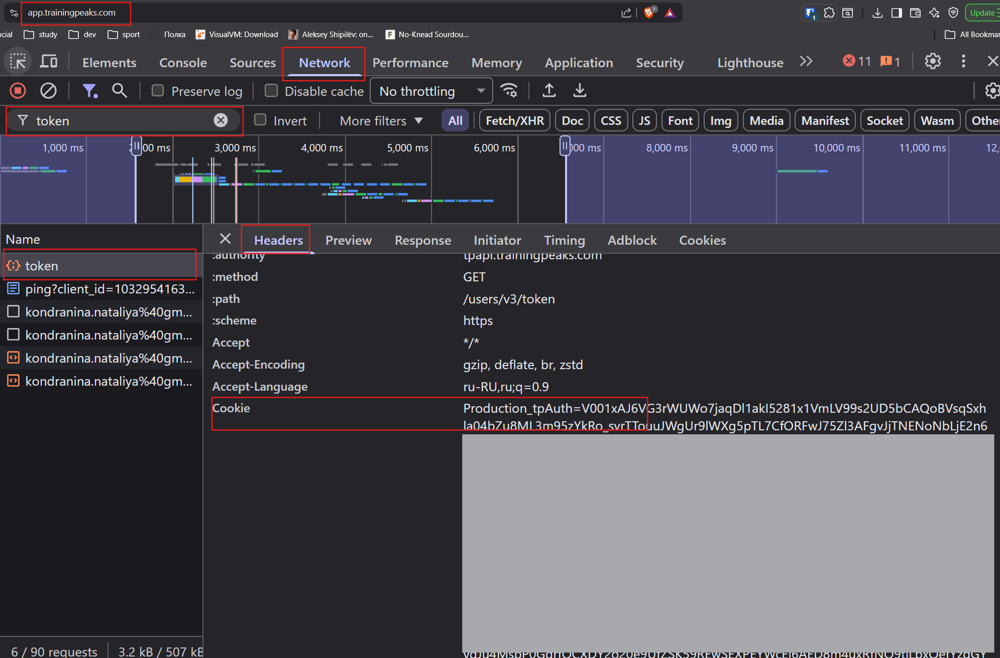

# tp2excel

Exports training plans from TrainingPeaks to Excel (.xlsx) files.

Each plan is saved as a spreadsheet with one row per week and columns for each day of the week.

---

## Quick Start

1. Go to [Releases](../../releases) and download the file for your OS:
   - Windows: `tp2excel.exe`
   - macOS: `tp2excel-mac`
2. Run it
3. When prompted, paste your TrainingPeaks cookie — it looks like:
   ```
   Production_tpAuth=V001xAJ6.....
   ```
   See [How to get your cookie](#how-to-get-your-trainingpeaks-cookie) below.
4. Pick a plan from the list — the `.xlsx` file is saved in the same folder

> **Windows:** You may see a "Windows protected your PC" SmartScreen popup.
> Click **"More info"** → **"Run anyway"**. This is normal for unsigned open-source apps.

> **macOS:** You may see a warning that the app can't be opened. Go to **System Settings** → **Privacy & Security** → scroll down and click **"Open Anyway"**.

---

## How to get your TrainingPeaks cookie

1. Open [trainingpeaks.com](https://www.trainingpeaks.com) in Chrome and log in
2. Press `F12` → **Application** → **Cookies** → `https://www.trainingpeaks.com`
3. Find the cookie named `Production_tpAuth` and copy its value
4. The full cookie string should look like: `Production_tpAuth=V001xAJ6.....`



---

## ⚠️ Important — Please Read

This tool is intended for **personal, non-commercial use only**.

- Only export training plans that you have legally purchased or that are freely available to you.
- Do not use this tool to redistribute, resell, or share exported plans — the content belongs to the plan authors.
- The resulting Excel files are for your own personal training reference only.

By using this tool you take full responsibility for ensuring you have the right to export and use the plans.

---

## Option 2: Run from source (requires Python 3.11+)

**1. Install dependencies**

```bash
pip install -r requirements.txt
```

**2. Create `.env` file**

```bash
cp .env.example .env
```

Fill in your TrainingPeaks auth cookie:

```
TP_AUTH_COOKIE=Production_tpAuth=V001xAJ6.....
```

**3. Run**

```bash
# Interactive — lists your plans, you pick one
python main.py

# Export a specific plan by ID
python main.py --plan-id 12345

# Export all plans
python main.py --all
```

The `.xlsx` file is saved in the current directory.
